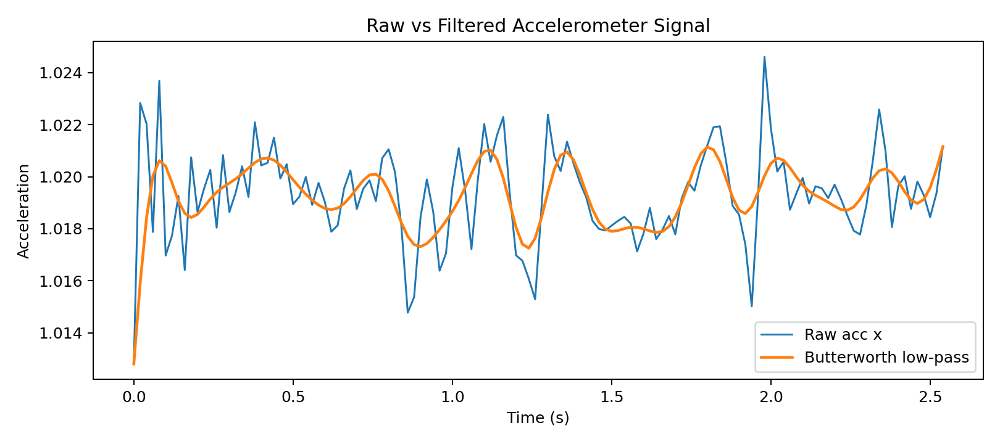
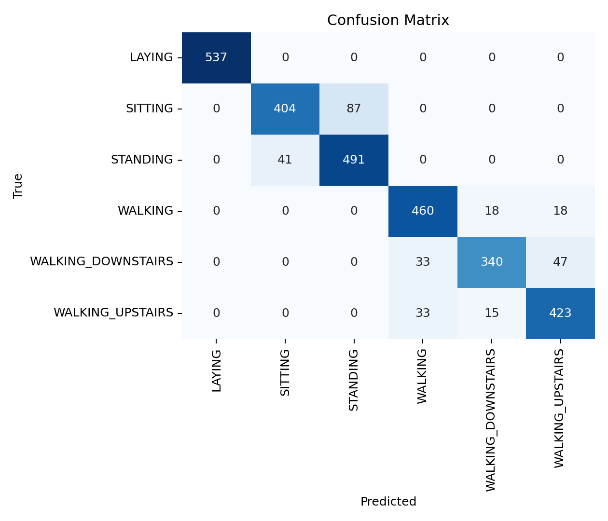

# WearableSignalLab

WearableSignalLab is a reproducible IMU signal-processing and human activity
classification pipeline. It demonstrates how accelerometer and gyroscope
signals can be prepared, filtered, transformed into movement features, and
evaluated with a transparent machine-learning baseline.

## Why It Matters

Wearable-based movement monitoring often starts with noisy accelerometer and
gyroscope signals. A credible first step is to show that raw sensor windows can
be loaded, filtered, summarized with movement features, and evaluated with a
transparent baseline classifier. This repository keeps that workflow focused
and reproducible.

## Why UCI HAR is Used

This version uses the UCI Human Activity Recognition Using Smartphones
Dataset because it provides a well-documented public benchmark for wearable and
mobile sensing workflows. It includes synchronized accelerometer and gyroscope
inertial signals, predefined train/test splits, and six human activity labels.
These properties make the dataset suitable for validating the full processing
path from signal windows to features, model training, and error analysis.

UCI HAR is not a sport-specific dataset. It is used here as a controlled
starting point for demonstrating IMU analytics methods before moving toward
continuous recordings, athlete-specific data, or sport-specific movement tasks.

## Relevance to Sports Technology

Sports technology applications often depend on the same core steps shown in
this repository: cleaning wearable sensor signals, extracting movement features,
identifying repeated patterns, and evaluating model errors across movement
classes. Although the labels in UCI HAR describe daily activities rather than
sports actions, the workflow is relevant to athlete monitoring, movement
screening, training-load analysis, and technique assessment.

The current pipeline is therefore a foundation for sport-focused extensions,
such as classifying jumps, running phases, changes of direction, or
rehabilitation exercises from wearable IMU data.

## Dataset

This version uses the UCI Human Activity Recognition Using Smartphones
Dataset. The dataset contains accelerometer and gyroscope inertial signals from
smartphone sensors, with predefined train/test splits and six activity labels.

Source:
https://archive.ics.uci.edu/dataset/240/human+activity+recognition+using+smartphones

Citation:

Davide Anguita, Alessandro Ghio, Luca Oneto, Xavier Parra and Jorge L. Reyes-Ortiz.
"A Public Domain Dataset for Human Activity Recognition Using Smartphones."
ESANN 2013.

Large raw data files are not committed. Run the preparation script to download
and extract the dataset into `data/UCI HAR Dataset/`.

## Pipeline

1. Download and prepare UCI HAR data.
2. Load accelerometer and gyroscope inertial signal windows.
3. Apply a Butterworth low-pass filter to a raw accelerometer segment.
4. Compute accelerometer and gyroscope magnitude signals.
5. Extract time-domain and frequency-domain features.
6. Train a baseline Random Forest classifier.
7. Save metrics, reports, feature tables, and diagnostic figures.

## Reproduce

Create an environment and install dependencies:

```bash
python3 -m venv .venv
source .venv/bin/activate
pip install -r requirements.txt
```

Run the full pipeline:

```bash
python3 scripts/01_prepare_data.py
python3 scripts/02_filter_and_features.py
python3 scripts/03_train_baseline.py
python3 scripts/04_make_figures.py
```

Expected outputs:

```text
outputs/features.csv
outputs/classification_report.txt
outputs/metrics.json
figures/raw_vs_filtered_signal.png
figures/signal_magnitude_or_peak_detection.png
figures/feature_distribution_by_activity.png
figures/confusion_matrix.png
```

## Example Outputs

The repository generates:

- Raw vs filtered accelerometer signal figure.
- Accelerometer magnitude and peak detection figure.
- Feature distribution by activity figure.
- Confusion matrix for the baseline classifier.
- CSV, JSON, and text outputs under `outputs/`.

## Visual Summary





## Results Summary

In the current version, the Random Forest baseline produced:

- Accuracy: 0.9009
- Macro F1-score: 0.8980
- Train windows: 7,352
- Test windows: 2,947
- Extracted features: 74

These values are saved in `outputs/metrics.json` and should be treated as
reproducible baseline results.

## Error Analysis

The confusion matrix shows that the most reliable class is `LAYING`, with all
537 test windows correctly classified. The main errors occur between activities
with similar posture or movement patterns:

- `SITTING` and `STANDING` are sometimes confused with each other. The model
  classified 87 sitting windows as standing and 41 standing windows as sitting.
- Dynamic walking classes also overlap. `WALKING_DOWNSTAIRS` is confused with
  `WALKING_UPSTAIRS` 47 times and with `WALKING` 33 times.
- `WALKING` and `WALKING_UPSTAIRS` have smaller two-way confusion, with 18
  walking windows predicted as upstairs and 33 upstairs windows predicted as
  walking.

This pattern is expected for a compact feature-based baseline: posture-only
classes can be close in static signal statistics, while walking variants share
periodic acceleration patterns and differ mainly in direction, intensity, and
subject-specific movement style.

## Technical Scope and Limitations

- The pipeline uses pre-segmented UCI HAR windows and does not reconstruct a
  continuous raw recording.
- The model is a Random Forest baseline trained on engineered time-domain and
  frequency-domain features.
- The current evaluation uses the dataset's predefined train/test split rather
  than subject-wise or leave-one-subject-out validation.
- The dataset uses smartphone IMU signals from daily activities, so
  generalization to sport-specific settings requires new data collection and
  validation.
- Sensor placement, sampling conditions, participant variability, and label
  definitions can all affect transfer to real athlete-monitoring workflows.

## Future Direction

This project can be extended toward sports technology and human movement
analytics by adding raw continuous wearable datasets, sport-specific movement
labels, subject-wise validation, richer frequency features, and more careful
error analysis.
